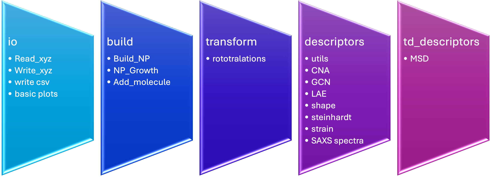
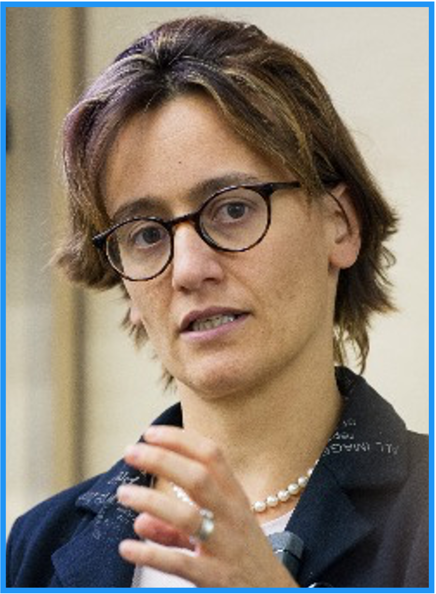

<h1>
  
  pySNOW
</h1>

`pySNOW` (a Python Suite for the NanO-World), is written in the [Python :fontawesome-brands-python:](https://www.python.org/) programming language with the aim of providing a user friendly integrated set of tools for the analysis of atomic configurations originating from MD and other atomistic simulations. The code is freely available on [GitHub](https://github.com/nanoMLMS/pySNOW).

## Design principles

`pySNOW` is designed around a set of core principles:  
(1) **ease of use** — enabling fast learning by scientists from diverse backgrounds,  
(2) **ease of modification** — facilitating extension and customization of its components,  
(3) **minimal dependencies** — relying only on `numpy` and `scipy` to ensure long-term stability and reduce compatibility issues with future releases, and  
(4) **integrability** — allowing seamless interaction with external simulation and analysis workflows.

Further details on the `pySNOW` ontology will be avaiable in an upcoming dedicated publication.

## Documentation Structure

This documentation is organized into the following sections:

- Installation  
- Physics  
- Modules  
- Tutorial  

### Overview of modules workflow

The `pySNOW` workflow is built as a set of modular components that enable step-by-step processing of atomic configurations generated from molecular dynamics (MD) simulations or other atomistic modeling techniques. The framework supports data import, preprocessing, and analysis through dedicated routines, ultimately enabling the extraction of relevant structural and physical properties.

A schematic representation of the workflow is shown below:

## How to cite
To cite pySNOW you can refer to the following DOI:

## The team
`pySNOW` is developed within the research group of Francesca Baletto at the University of Milan.

Here some of the main contributors:

<table>
  <tr>
    <td align="center">
       
      <b>Francesca Baletto</b>
    </td>
    <td align="center">
       
      <b>Sofia Zinzani</b>
    </td>
    <td align="center">
       
      <b>Gilberto Nardi</b>
    </td>
    <td align="center">
       
      <b>Giacomo Becatti</b>
    </td>
    <td align="center">
       
      <b>Davide Alimonti</b>
    </td>
  </tr>
</table>

<!--
- :fontawesome-brands-github: __GitHub__ Get pySnow on [GitHub](https://github.com/nanoMLMS/pySNOW) 
-->

